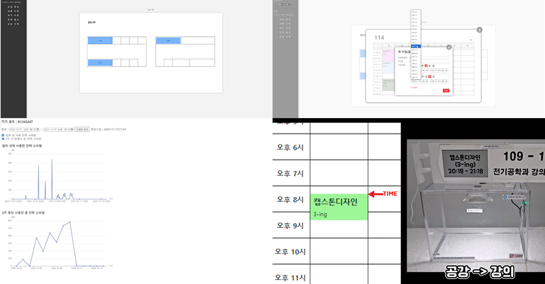

# 스마트 저전력 표지판

## 프로젝트 개요
교실 앞 종이 시간표를 확인하는 불편함을 해소하기 위한 중앙집중관리 스마트 IoT 시스템입니다.
전자종이 디스플레이(E-Paper)를 활용하여 저전력으로 실시간 강의 정보를 제공합니다.

**개발 기간**: 2024.03 ~ 2024.11 (약 8개월)  
**팀 구성**: 컴퓨터공학 1명, 전기공학 2명, 기계공학 1명

## 프로젝트 미디어 자료

https://www.youtube.com/watch?v=apCBiD5LA90&list=PL0bpLNgLWNqSEkyhUqsxgQeczZ1ajG5RY&index=9

## 수상 내역
- 교내 캡스톤 경진대회 **대상**
- 2024 창의적 종합설계 경진대회 소재 컨소시엄 예선 **동상**

## 주요 기능
- 웹 기반 중앙집중 관리 시스템
- 실시간 교실 데이터 관리 (CRUD)
- 전력 모니터링 시스템
- 실시간 교실 위치 이동 기능
- 시간표 자동 업데이트

## 기술 스택

### Frontend
- HTML, CSS, JavaScript
- AJAX 비동기 통신

### Backend
- Ubuntu Server 20.04
- Apache2 Web Server
- PHP
- MySQL

### Hardware
- ESP32 (IoT 보드)
- E-Paper Display (전자종이)
- Raspberry Pi 4B (서버)

## 시스템 아키텍처

## 주요 성과
- Raspberry Pi 활용한 자체 서버 구축으로 SW 비용 최소 8만원 절감
- E-Paper 데이터 변환 완전 자동화 (384,000픽셀 → 48,000개 16진수 8배 압축)
- 사용자 응답속도 85% 개선 (1.2초 → 0.2초)
- 데이터 전송 안정성 확보 및 유실율 0% 달성

## Contact
이동주 / ldj5098@gmail.com / 010-9991-5098
